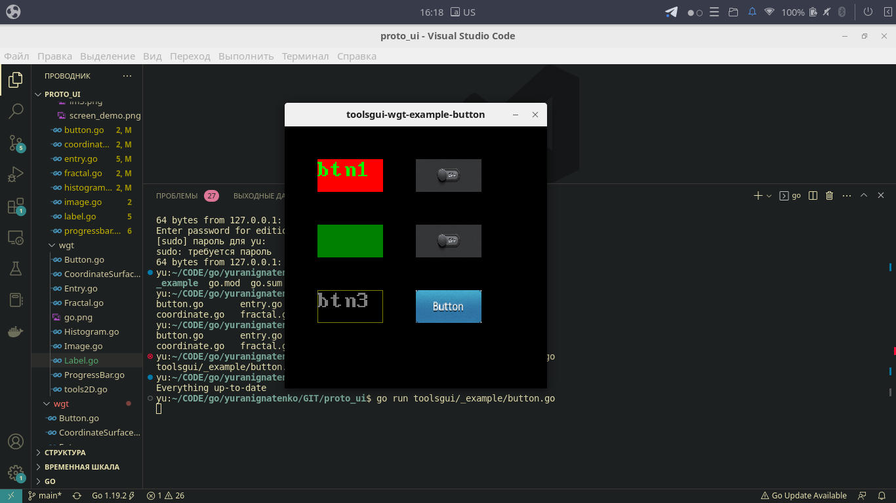
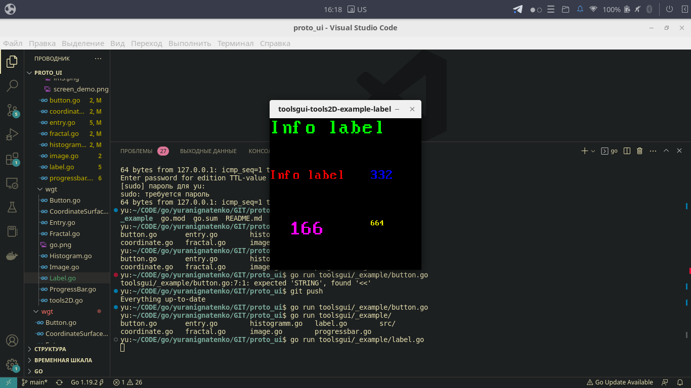
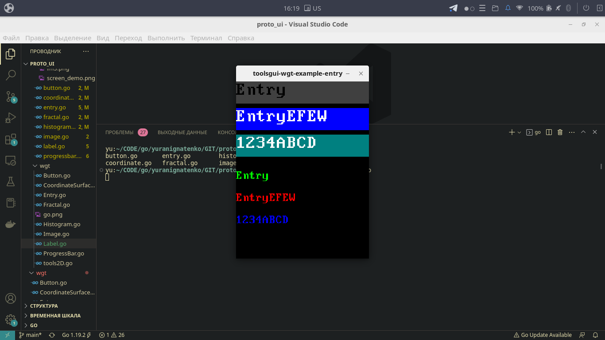
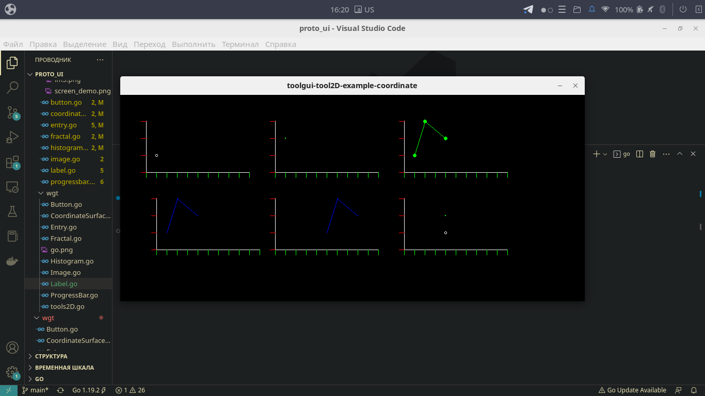
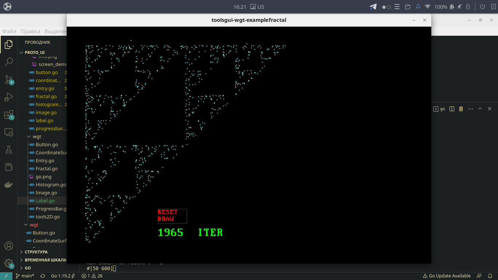
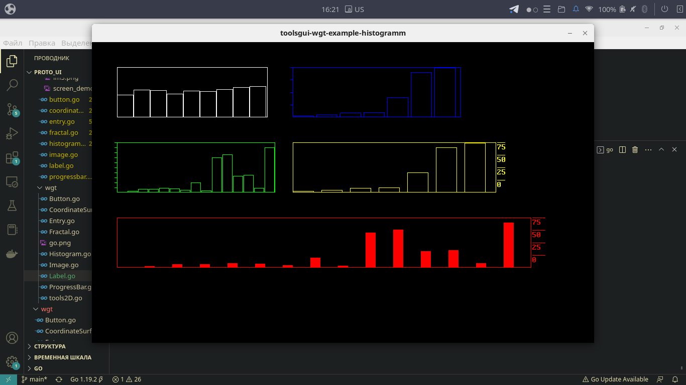
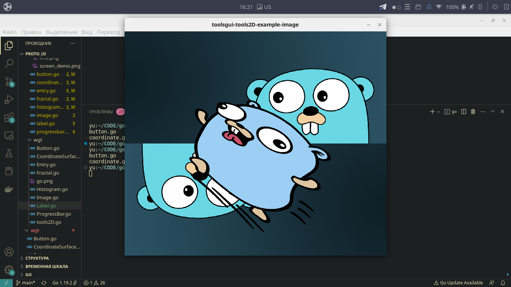
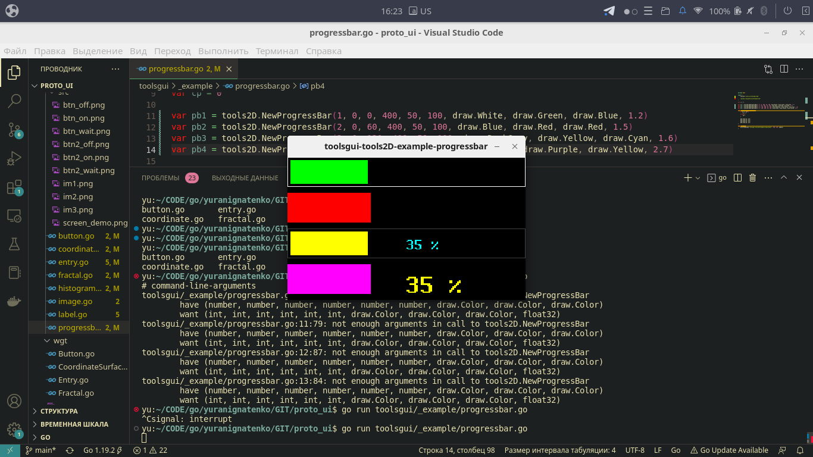

# proto_ui

this prototype *

> Demo


***

```
На данный момент вы можете реализовать простейшие виджеты и далее взаимодействовать с ними
Разместите как простейшие кнопки так и кастомные со своим отбражением,размещайте как текст, так
и картинки, визуализируйте свой прогресс с помощью ProgressBar, выводите графики функций и 
другие данные на координатную плоскость CoordinateSurface, используйте столбчатые диаграммы и поля для ввода
текста - это добавит динамичности и работу с клиентом. Дополнительно имеется структура FractalMath
для получения координат и отрисовки точками на поверхности треугольник Серпинского.
```

> Requirements
```
go get github.com/gonutz/prototype/draw
```

> Install
```
sudo apt install libx11-dev libxrandr-dev libgl1-mesa-dev libxcursor-dev libxinerama-dev libxi-dev

sudo apt install libsdl2-dev libsdl2-mixer-dev l
ibsdl2-image-dev

1234
```


> Пример использования:

```go
package main

import (
	"github.com/gonutz/prototype/draw"
	"github.com/toolsgui/tools2D"
)

// имя переменной = виджет(парамеры)
var NAMEVAR = tools2D.[WIDGET](..PARAMS)

// функция обновления
func FUNCTIONUPDATE(win draw.Window) {
	NAMEVAR.View(win)
}

// точка входа
func main() {
  // создание окна (имя заголовка, ширина, высота, функция обновления)
	draw.RunWindow("Name window", WidthSize, HeightsSise, FUNCTIONUPDATE)
} 
```

> Вам нужно:
```
--> Создать виджеты и глобально сохранить в переменные.
--> Создать точку входа (функцию Main) 
--> Создать функцию для обновления окна и всего что в нем расположите
```

> Screen examples
```bash
go run _example/demo_all.go 
go run toolsgui/_example/label.go
go run toolsgui/_example/button.go
go run toolsgui/_example/entry.go
go run toolsgui/_example/progressbar.go
go run toolsgui/_example/coordinate.go
go run toolsgui/_example/fractal.go
go run toolsgui/_example/histogramm.go
go run toolsgui/_example/image.go

# OR run all demo

bash toolsgui/_example/run_all.sh 
```








